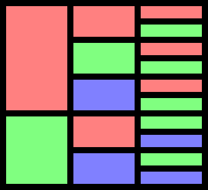

# RelationNormalizer

Normalize relation schemas

# How it works

## Set Trie Data Structure

Due to the many set operations used, the relation schema normalizer uses a data
structure called a set trie, which is a set of sets. A set trie is like a
normal trie, except it stores sets instead of sequences. It does this by first
sorting the elements of a set before inserting it. Set tries support relatively
efficient subset and superset querying (i.e., checking whether there is a
subset or a superset of a given set in the set trie). For more information,
read the paper by Savnik, I. at <https://doi.org/10.1007/978-3-642-40511-2_10>.
This program also uses a dictionary and a multimap based on the set trie, with
sets as keys.

## Finding Minimal Determinant Sets

The first step in the normalization is to find all minimal determinant sets for
each attribute. That is, to find all sets on the left-hand side of every valid
functional dependency, such that removing an attribute from the set makes the
functional dependency invalid. To do this, the normalizer iterates through all
the provided determinant sets of an attribute and produces new determinant sets
by replacing a single attribute with one of its provided determinant sets.
Additionally, we discard determinant sets that aren't minimal whenever we
detect one to keep the number of sets to a manageable level. This process of
producing new determinant sets continues until all possibilities are exhausted.
Trivial functional dependencies are discarded during this process, as they are
useless. We also include the minimal trivial determinant set (e.g., for an
attribute $A$, $\{A\}$ is the minimal trivial determinant set), which is
important for determining candidate keys.

## Finding Candidate Keys

To find the candidate keys of a set of attributes, we start with the set of the
minimal determinant sets of one of the attributes, which are the candidate keys
for the set of attributes containing only that attribute. Then, we take the set
of the minimal determinant sets of another attribute and take its Cartesian
product with the result of the previous step. We then take the union of each
pair of sets in the Cartesian product and keep only minimal sets to produce a
new set that contains all candidate keys of the set of all previously processed
attributes. This is repeated until all attributes have been processed. The end
result is the candidate keys of the attributes. Taking minimal sets at each
step prevents the number of sets from exploding and is necessary at the end to
produce candidate keys, which are themselves minimal.

For example, we might have

-   $\{A\} \rightarrow \{A\}$,
-   $\{A\} \rightarrow \{B\}$, and
-   $\{B\} \rightarrow \{B\}$.

The first step will produce $\{\{A\}\}$ as the set of candidate keys of
$\{A\}$. Then, we take $\{\{A\}\} \times \{\{A\}, \{B\}\}$ to get
$\{(\{A\}, \{A\}), (\{A\}, \{B\})\}$. We take the union of each pair of sets to
get $\{\{A\}, \{A, B\}\}$. Finally, we keep only the minimal sets to get
$\{\{A\}\}$, which is the set of all candidate keys of $\{A, B\}$.

## Finding the Canonical Cover

First, we group the minimal determinant sets into functional dependencies by
grouping the dependent attributes into dependent sets. We discard trivial
functional dependencies while doing this.

For example, we might have

-   $\{A, B\} \rightarrow \{C, D\}$ and
-   $\{B, C\} \rightarrow \{D\}$.

Note that $\{A, B, C\} \rightarrow \{D\}$ isn't included, because $\{A, B\}$
and $\{B, C\}$ are proper subsets of $\{A, B, C\}$. Neither are
$\{A, B, D\} \rightarrow \{C\}$ and other functional dependencies with a
non-minimal determinant set.

If we only need 2NF, this is enough, so we can skip to the next set.

However, if we need 3NF or BCNF, we need to remove redundant information in the
form of transitive dependencies, which will result in the canonical cover. A
worked example serves best to illustrate how this is done.

Taking our previous example, we see that $\{A, B\} \rightarrow \{D\}$, but also
that $\{A, B\} \rightarrow \{C\}$ and $\{B, C\} \rightarrow \{D\}$. Since
$\{B, C\} \subseteq (\{A, B\} \cup \{C\})$ and $\{B, C\} \nsupseteq \{A, B\}$,
we conclude that $\{D\}$ is transitively dependent on $\{A, B\}$ via the
functional dependency $\{B, C\} \rightarrow \{D\}$, and remove the functional
dependency $\{A, B\} \rightarrow \{D\}$. To avoid over-detecting transitive
dependencies, which can result in losing information when there are circular
dependencies, we make sure to avoid using the functional dependency
$\{A, B\} \rightarrow \{D\}$ to check for transitive dependencies in later
steps.

Note that there is no difference between targeting 3NF and BCNF. Often, tables
in 3NF are also in BCNF, and relation schemas with circular dependencies might
be impossible to normalize to BCNF without losing functional dependencies.

## Creating the Tables

From our functional dependencies in the previous step, we take the sets of
attributes in each functional dependency and keep only maximal sets. This forms
a set of sets of attributes, which each set of attributes corresponding to a
table. If no table contains a candidate key, we also create a table containing
one of the smallest candidate keys. This prevents attributes from disappearing
from the result, which can happen if an attribute doesn't appear in any
non-trivial functional dependency.

For each table, we calculate the set of candidate keys of that table and
discard candidate keys with attributes that are not contained in that table.
This determines the unique keys, and we choose one of the smallest unique keys
to be the primary key. With the set of unique keys and minimal determinant
sets, we can then determine the normal form of the table (which might not be as
high as the targeted normal form) using the definitions of 2NF, 3NF, and BCNF
and the set trie data structure to make the process relatively efficient.

## Determining Foreign Keys

The program essentially guesses what the best foreign keys are by assuming that
smaller foreign keys are usually more sensible than larger foreign keys.
Therefore, it takes the set of minimal unique keys from all tables as possible
foreign keys, and then, for every table, adds all foreign keys possible. Each
foreign key references the table from which the corresponding unique key was
taken as a possible foreign key.

# 4NF

## MVD Validation

To validate user-provided multivalued dependencies, we discard duplicate rows
from the user-provided table data. This is done by first sorting the table and
then discarding rows that are equal to the row above.

Then, for each MVD, we split the columns into columns in the LHS, columns in
the RHS but not in the LHS, and other columns. We then sort the table first by
comparing the LHS columns, then the RHS columns, and then the other columns.
This allows the program to view the table as something like the following:

where the first column in the visualization represents the LHS columns, the
second column the RHS columns, and the third column the other columns.

If, for every value of the LHS columns, the other columns repeat for every
value of the RHS columns, the MVD is valid.

## Normalizing to 4NF

For a multivalued dependency $X \twoheadrightarrow Y$, we can partition the
relation into three sets of attributes $A$, $B$, and $C$ such that $A = X$,
$B \subseteq Y$, and $A \cup B = X \cup Y$. Then, if we wish to achieve 4NF, we
remove functional dependencies with determinant attribute(s) in $B$ and
dependent attribute(s) in $C$ or vice versa. This is technically not always
correct, but it should be correct in any sane specification with multivalued
dependencies. Still, we warn the user when this occurs.

When it comes to generating tables, for every table, the set of attributes $R$
into that table is broken up into $R \cap (A \cup B)$ and $R \cap (A \cup C)$.
Since we only keep maximal sets of attributes, this has no effect if $R$ was
already a subset of $A \cup B$ or $A \cup C$.
